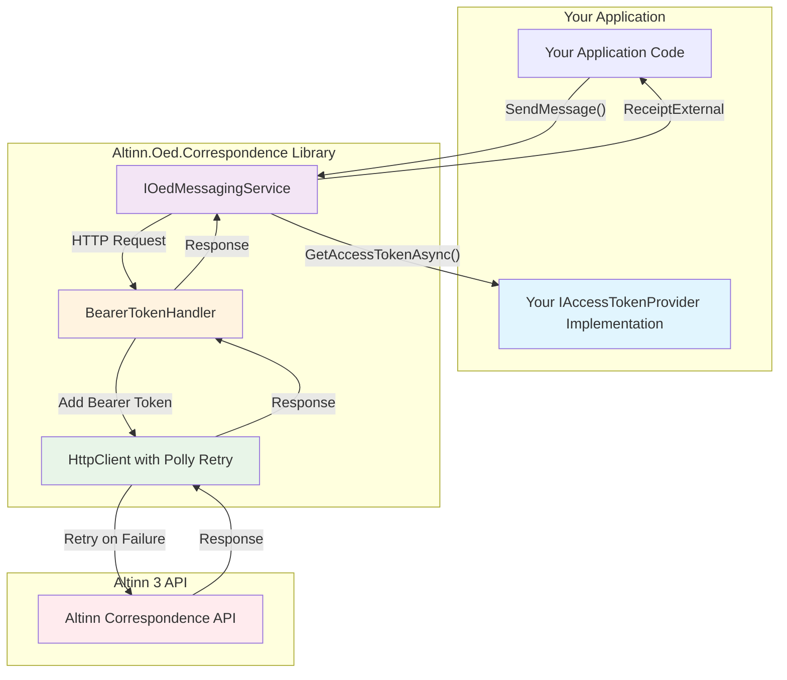

# Altinn.Oed.Correspondence

A .NET library for sending correspondence through Altinn 3 Correspondence API. Provides backward compatibility with Altinn 2 messaging interface.

## Quick Start

### 1. Install Package

```bash
dotnet add package Altinn.Oed.Correspondence
```

### 2. Configure Settings

Add to your `appsettings.json`:

```json
{
  "AltinnMessagingSettings": {
    "CorrespondenceSettings": "your-resource-id,your-sender-org",
    "UseAltinnTestServers": true,
    "CountryCode": "0192"
  },
  "OedConfig": {
    "MaskinportenSettings": {
      "ClientId": "your-client-id",
      "Scope": "altinn:serviceowner/correspondence",
      "WellKnownEndpoint": "https://maskinporten.no/.well-known/oauth-authorization-server"
    }
  }
}
```

### 3. Implement Token Provider

**Important**: You must implement the `IAccessTokenProvider` interface to provide authentication tokens to the Altinn Correspondence API. This interface is not provided by the library - you need to create your own implementation.

The `IAccessTokenProvider` interface has one method:
```csharp
public interface IAccessTokenProvider
{
    Task<string> GetAccessTokenAsync();
}
```

#### Complete Maskinporten Implementation Example

Here's a complete, working implementation using `Altinn.ApiClients.Maskinporten`:

```csharp
using Altinn.Oed.Correspondence.Authentication;
using Altinn.ApiClients.Maskinporten.Services;
using Altinn.ApiClients.Maskinporten.Interfaces;
using Microsoft.Extensions.Configuration;
using Microsoft.Extensions.Logging;

public class MaskinportenTokenAdapter : IAccessTokenProvider
{
    private readonly IMaskinportenService _maskinportenService;
    private readonly IConfiguration _config;
    private readonly ILogger<MaskinportenTokenAdapter> _logger;

    public MaskinportenTokenAdapter(
        IMaskinportenService maskinportenService, 
        IConfiguration config, 
        ILogger<MaskinportenTokenAdapter> logger)
    {
        _maskinportenService = maskinportenService;
        _config = config;
        _logger = logger;
    }

    public async Task<string> GetAccessTokenAsync()
    {
        try
        {
            var maskinportenSettings = _config.GetSection("OedConfig:MaskinportenSettings");
            var clientId = maskinportenSettings["ClientId"];
            var scope = maskinportenSettings["Scope"];
            
            _logger.LogDebug("Requesting Maskinporten token for client {ClientId} with scope {Scope}", 
                clientId, scope);
            
            var token = await _maskinportenService.GetTokenAsync(clientId, scope);
            
            _logger.LogDebug("Successfully retrieved Maskinporten token");
            return token.AccessToken;
        }
        catch (Exception ex)
        {
            _logger.LogError(ex, "Failed to retrieve Maskinporten token");
            throw;
        }
    }
}
```

**Note**: For a complete working example, see the `SendOedCorrespondence` project in this repository, which includes the full `MaskinportenTokenAdapter` implementation.

### 4. Register Services

The `AddOedCorrespondence()` extension method handles all the complex service registration for you, including HttpClient, authentication handlers, and retry policies. You only need to register your `IAccessTokenProvider` implementation.

In your `Program.cs`:

```csharp
using Altinn.Oed.Correspondence.Extensions;
using Altinn.Oed.Correspondence.Models;
using Altinn.Oed.Correspondence.Models.Interfaces;
using Altinn.Oed.Correspondence.Services.Interfaces;
using Altinn.Oed.Correspondence.Authentication;

var builder = WebApplication.CreateBuilder(args);

// Step 1: Get settings from configuration
var settings = builder.Configuration.GetSection("AltinnMessagingSettings").Get<Settings>()!;

// Step 2: Register your token provider implementation
builder.Services.AddSingleton<IAccessTokenProvider>(sp =>
{
    var maskinportenService = sp.GetRequiredService<IMaskinportenService>();
    var logger = sp.GetRequiredService<ILogger<MaskinportenTokenAdapter>>();
    return new MaskinportenTokenAdapter(maskinportenService, builder.Configuration, logger);
});

// Step 3: Register correspondence services (handles HttpClient, BearerTokenHandler, Polly retry policies)
builder.Host.AddOedCorrespondence(settings, builder.Services.BuildServiceProvider().GetRequiredService<IAccessTokenProvider>());

var app = builder.Build();
```

**What `AddOedCorrespondence()` does for you:**
- Registers `HttpClient` with proper configuration
- Adds `BearerTokenHandler` for automatic token injection
- Configures Polly retry policies (3 retries with exponential backoff)
- Registers `IOedMessagingService` as a singleton
- Sets up proper dependency injection for all correspondence services

**You don't need to manually register:**
- `HttpClient` or `IHttpClientFactory`
- `BearerTokenHandler`
- Polly retry policies
- `IOedMessagingService`

### 5. Send Correspondence

```csharp
using Altinn.Oed.Correspondence.Models;
using Altinn.Oed.Correspondence.Services.Interfaces;
using Altinn.Oed.Correspondence.ExternalServices.Correspondence;

// Inject the service
var messagingService = app.Services.GetRequiredService<IOedMessagingService>();

// Create message
var message = new OedMessageDetails
{
    Recipient = "12345678901", // SSN or org number
    Title = "Important Notice",
    Summary = "Brief summary",
    Body = "Full message content",
    Sender = "Your Organization",
    VisibleDateTime = DateTime.UtcNow,
    ShipmentDatetime = DateTime.UtcNow.AddMinutes(1),
    AllowForwarding = false,
    Notification = new NotificationDetails
    {
        SmsText = "SMS notification text",
        EmailSubject = "Email subject",
        EmailBody = "Email body content"
    }
};

// Send message
var receipt = await messagingService.SendMessage(message);

// Check result
if (receipt.ReceiptStatusCode == ReceiptStatusEnum.OK)
{
    Console.WriteLine($"Success: {receipt.ReceiptText}");
}
else
{
    Console.WriteLine($"Error: {receipt.ReceiptText}");
}
```

## Architecture Overview

The `Altinn.Oed.Correspondence` library provides a clean abstraction over the Altinn 3 Correspondence API while maintaining compatibility with Altinn 2 interfaces. Here's how the components work together:



### Key Components

**IOedMessagingService**: The main service interface that your application uses to send correspondence. Maintains compatibility with Altinn 2 interfaces.

**IAccessTokenProvider**: Interface that you must implement to provide authentication tokens. The library calls `GetAccessTokenAsync()` before each API request.

**BearerTokenHandler**: Automatically adds the Bearer token from your `IAccessTokenProvider` to outgoing HTTP requests.

**HttpClient with Polly**: Handles HTTP communication with automatic retry policies (3 retries with exponential backoff) for transient failures.

**Idempotency Key**: Automatically generates unique GUIDs for each correspondence request to prevent duplicates during retries.

### Service Registration Flow

When you call `AddOedCorrespondence()`, the library:

1. **Registers HttpClient**: Creates a configured `HttpClient` instance
2. **Adds Authentication**: Registers `BearerTokenHandler` to inject tokens automatically
3. **Configures Retry Policy**: Sets up Polly with exponential backoff for resilience
4. **Registers Services**: Makes `IOedMessagingService` available for dependency injection
5. **Validates Settings**: Ensures your configuration is valid using data annotations

### Error Handling

The library provides comprehensive error handling:

- **Network Failures**: Automatically retried with exponential backoff
- **Authentication Errors**: Wrapped in `CorrespondenceServiceException` with clear messages
- **Validation Errors**: Settings are validated using data annotations
- **API Errors**: Altinn 3 API errors are preserved and wrapped for consistency

## Example Implementation

### SendOedCorrespondence Project

This repository includes a working example project called `SendOedCorrespondence` that demonstrates:

- Complete implementation of `IAccessTokenProvider` using Maskinporten
- Proper service registration using `AddOedCorrespondence()` extension method
- Full correspondence sending workflow
- Configuration setup for both test and production environments

**Key features of the example:**
- Uses `Altinn.ApiClients.Maskinporten` for authentication
- Implements `MaskinportenTokenAdapter` as a reference implementation
- Includes proper error handling and logging
- Ready-to-run console application for testing

**To use the example:**
1. Navigate to the `SendOedCorrespondence` project
2. Configure your `appsettings.json` with your Maskinporten settings
3. Run `dotnet run` to test correspondence sending

This example serves as both a testing tool and a reference implementation for integrating the `Altinn.Oed.Correspondence` package into your applications.

## Migration from Altinn.Oed.Messaging

### Overview
This guide covers migrating from `Altinn.Oed.Messaging` to `Altinn.Oed.Correspondence` (Altinn 3). The new package keeps the same high-level service contract while simplifying the receipt model.

### Prerequisites
- `Altinn.Oed.Correspondence` v1.0.0 (supports net8.0 and net9.0)
- .NET 8.0+ or .NET 9.0+
- Maskinporten integration configured in your app

### Step 1: Update Package References
```xml
<!-- Remove old -->
<!-- <PackageReference Include="Altinn.Oed.Messaging" Version="0.10.2" /> -->

<!-- Add new -->
<PackageReference Include="Altinn.Oed.Correspondence" Version="1.0.0" />
```

### Step 2: Add Required Using Statements
```csharp
using Altinn.Oed.Correspondence.Extensions;
using Altinn.Oed.Correspondence.Models;
using Altinn.Oed.Correspondence.Models.Interfaces;
using Altinn.Oed.Correspondence.Services.Interfaces;
using Altinn.Oed.Correspondence.ExternalServices.Correspondence;
using Altinn.Oed.Correspondence.Authentication;
```

### Step 3: Update Service Registration

**Remove old registration:**
```csharp
// OLD - Remove this
services.AddSingleton<IOedMessagingService, OedMessagingService>();
services.AddTransient<BearerTokenHandler>();
services.AddHttpClient<IOedMessagingService, OedMessagingService>()
    .AddHttpMessageHandler<BearerTokenHandler>();
```

**Replace with new registration:**
```csharp
// NEW - Add this
var settings = builder.Configuration.GetSection("AltinnMessagingSettings").Get<Settings>()!;

// Register your token provider (implement IAccessTokenProvider)
builder.Services.AddSingleton<IAccessTokenProvider>(sp =>
{
    var maskinportenService = sp.GetRequiredService<IMaskinportenService>();
    var logger = sp.GetRequiredService<ILogger<MaskinportenTokenAdapter>>();
    return new MaskinportenTokenAdapter(maskinportenService, builder.Configuration, logger);
});

// Register correspondence services
builder.Host.AddOedCorrespondence(settings, builder.Services.BuildServiceProvider().GetRequiredService<IAccessTokenProvider>());
```

### Step 4: Update Configuration

**Old format:**
```json
{
  "AltinnMessagingSettings": {
    "BaseUrl": "https://your-altinn3-url",
    "CorrespondenceSettings": {
      "Sender": "Your Sender Name"
    }
  }
}
```

**New format:**
```json
{
  "AltinnMessagingSettings": {
    "CorrespondenceSettings": "your-resource-id,your-sender",
    "UseAltinnTestServers": true,
    "CountryCode": "0192"
  },
  "OedConfig": {
    "MaskinportenSettings": {
      "ClientId": "your-client-id",
      "Scope": "altinn:serviceowner/correspondence",
      "WellKnownEndpoint": "https://maskinporten.no/.well-known/oauth-authorization-server"
    }
  }
}
```

### Step 5: Update Namespace References

Update all files in your project that reference the old messaging package:

**Replace old namespaces:**
```csharp
// OLD
using Altinn.Oed.Messaging.Models;
using Altinn.Oed.Messaging.Services.Interfaces;
using Altinn.Oed.Messaging.ExternalServices.Correspondence;

// NEW
using Altinn.Oed.Correspondence.Models;
using Altinn.Oed.Correspondence.Services.Interfaces;
using Altinn.Oed.Correspondence.ExternalServices.Correspondence;
```

**Common files to update:**
- Service classes that use `IOedMessagingService`
- Models that use `OedMessageDetails` or `ReceiptExternal`
- Controllers or API endpoints that send correspondence
- Test files that mock or test messaging functionality
- Extension methods that work with receipts

### Step 6: Update ReceiptExternal Usage

The new `ReceiptExternal` has a simplified structure. Update all code that uses the old properties:

**Old ReceiptExternal Structure:**
```csharp
public class ReceiptExternal
{
    public ReceiptStatusEnum ReceiptStatusCode { get; set; }
    public string ReceiptText { get; set; }
    public ReferenceList References { get; set; }  // REMOVED
    public List<ReceiptExternal> SubReceipts { get; set; }  // REMOVED
}
```

**New ReceiptExternal Structure:**
```csharp
public class ReceiptExternal
{
    public ReceiptStatusEnum ReceiptStatusCode { get; set; }
    public string ReceiptText { get; set; }
}
```

**Update ReceiptExternalExtensions.cs:**
```csharp
// OLD - Remove this logic
if (receipt.References.IsNullOrEmpty())
{
    logger.LogCritical("Message receipt references is null or empty.");
    throw new Exception($"Message receipt references is null or empty.");
}

logger.LogInformation("Message sent successfully with {ReceiptReference}",
    receipt.References.FirstOrDefault()?.ReferenceValue);

// NEW - Replace with simplified logic
if (receipt is not { ReceiptStatusCode: ReceiptStatusEnum.OK })
{
    logger.LogError("Unable to send message. ReceiptStatusCode: {ReceiptStatusCode}, Message: {ReceiptText}", 
        receipt.ReceiptStatusCode.ToString(), receipt.ReceiptText);
    throw new Exception($"Unable to send message. ReceiptStatusCode: {receipt.ReceiptStatusCode.ToString()}, Message: {receipt.ReceiptText}");
}

logger.LogInformation("Message sent successfully. Message: {ReceiptText}",
    receipt.ReceiptText);
```

**Update CorrespondenceReceiptValidator.cs:**
```csharp
// OLD - Remove this logic
if (receipt.References.IsNullOrEmpty())
{
    logger.LogCritical("Message receipt references is null or empty.");
    throw new Exception($"Message receipt references is null or empty.");
}

logger.LogInformation("Message sent successfully with {ReceiptReference}",
    receipt.References.FirstOrDefault()?.ReferenceValue);

// NEW - Replace with simplified logic
if (receipt is not { ReceiptStatusCode: ReceiptStatusEnum.OK })
{
    logger.LogError("Unable to send message. ReceiptStatusCode: {ReceiptStatusCode}, Message: {ReceiptText}", 
        receipt.ReceiptStatusCode.ToString(), receipt.ReceiptText);
    throw new Exception($"Unable to send message. ReceiptStatusCode: {receipt.ReceiptStatusCode.ToString()}, Message: {receipt.ReceiptText}");
}

logger.LogInformation("Message sent successfully. Message: {ReceiptText}",
    receipt.ReceiptText);
```

### Step 7: Update Test Files

**Update Test Utilities:**
```csharp
// OLD
using Altinn.Oed.Messaging.Models;

// NEW
using Altinn.Oed.Correspondence.Models;
using Altinn.Oed.Correspondence.ExternalServices.Correspondence;
```

**Update GetReceipt Method:**
```csharp
// OLD
public static ReceiptExternal GetReceipt()
    => new()
    {
        References = new ReferenceList
        {
            new Reference()
        },
        ReceiptStatusCode = ReceiptStatusEnum.OK
    };

// NEW
public static ReceiptExternal GetReceipt()
    => new()
    {
        ReceiptStatusCode = ReceiptStatusEnum.OK,
        ReceiptText = "Message sent successfully"
    };
```

**Update Test Helpers:**
```csharp
// OLD
itemService.SendMessage(Arg.Any<OedMessageDetails>(), Arg.Any<string>())
    .Returns(new ReceiptExternal
    {
        References = new ReferenceList
        {
            new Reference()
        },
        ReceiptStatusCode = ReceiptStatusEnum.OK,
    });

// NEW
itemService.SendMessage(Arg.Any<OedMessageDetails>(), Arg.Any<string>())
    .Returns(new ReceiptExternal
    {
        ReceiptStatusCode = ReceiptStatusEnum.OK,
        ReceiptText = "Message sent successfully"
    });
```

**Update Test Files:**
Update all test files that reference the old messaging package:

```csharp
// OLD
using Altinn.Oed.Messaging.Models;
using Altinn.Oed.Messaging.Services.Interfaces;

// NEW
using Altinn.Oed.Correspondence.Models;
using Altinn.Oed.Correspondence.Services.Interfaces;
using Altinn.Oed.Correspondence.ExternalServices.Correspondence;
```

**Update test mocks and helpers:**
```csharp
// OLD
itemService.SendMessage(Arg.Any<OedMessageDetails>(), Arg.Any<string>())
    .Returns(new ReceiptExternal
    {
        References = new ReferenceList
        {
            new Reference()
        },
        ReceiptStatusCode = ReceiptStatusEnum.OK,
    });

// NEW
itemService.SendMessage(Arg.Any<OedMessageDetails>(), Arg.Any<string>())
    .Returns(new ReceiptExternal
    {
        ReceiptStatusCode = ReceiptStatusEnum.OK,
        ReceiptText = "Message sent successfully"
    });
```

**Fix ProblemDetails Ambiguity:**
If you have tests using `ProblemDetails`, you may need to fully qualify the type:

```csharp
// OLD
Assert.IsType<ProblemDetails>(objectActual.Value);
var problemDetailsActual = (ProblemDetails)objectActual.Value;

// NEW
Assert.IsType<Microsoft.AspNetCore.Mvc.ProblemDetails>(objectActual.Value);
var problemDetailsActual = (Microsoft.AspNetCore.Mvc.ProblemDetails)objectActual.Value;
```

## Troubleshooting

### Common Issues

1. **"Type not found"** (e.g., `ReceiptExternal`): add `using Altinn.Oed.Correspondence.ExternalServices.Correspondence;`
2. **"BearerTokenHandler not found"**: you don't register it manually; ensure `builder.Host.AddOedCorrespondence(...)` is called and Maskinporten adapter is registered as `IAccessTokenProvider`.
3. **NU1605/NU1202**: ensure your consuming app uses net8.0+ and that the package you're consuming is the net8.0/net9.0 build (v1.0.0) with Microsoft.Extensions 8.0.x alignment.
4. **"IAccessTokenProvider not found"**: implement the interface or use the provided `MaskinportenTokenAdapter` example.

## API Reference

### Core Interfaces

- `IOedMessagingService`: Main service for sending correspondence
- `IAccessTokenProvider`: Authentication token provider

### Key Models

- `OedMessageDetails`: Complete correspondence information
- `NotificationDetails`: Optional email/SMS notification settings
- `Settings`: Service configuration
- `ReceiptExternal`: Response from correspondence service

### Extension Methods

- `AddOedCorrespondence()`: Registers all correspondence services with HttpClient, authentication, and retry policies

## GitHub Workflow

This package uses an automated GitHub Actions workflow for building and publishing NuGet packages.

### Workflow Triggers

The workflow (`release-correspondence.yaml`) triggers on:

- **Manual dispatch**: You can manually trigger the workflow from the GitHub Actions tab
- **Tagged releases**: When you create a tag starting with `correspondence-v` (e.g., `correspondence-v1.0.0`)

### Deployment Process

1. **Development**: Push changes to any branch - workflow will NOT run
2. **Testing**: Use manual workflow dispatch to test builds without publishing
3. **Release**: Create a tag like `correspondence-v1.0.0` to publish to NuGet.org

### Creating a Release

To publish a new version to NuGet.org:

```bash
# Create and push a tag
git tag correspondence-v1.0.0
git push origin correspondence-v1.0.0
```

The workflow will automatically:
- Build and test the package
- Create NuGet package with debug symbols
- Publish to NuGet.org (requires `NUGET_ORG_API_KEY` secret)

### Workflow Features

- **Multi-targeting**: Builds for both `net8.0` and `net9.0`
- **Testing**: Runs all unit and integration tests before packaging
- **Debug symbols**: Includes `.snupkg` files for debugging
- **Artifact upload**: Non-tagged builds create downloadable artifacts
- **Independent deployment**: Only deploys when Correspondence package changes

## License

Same as parent repository.